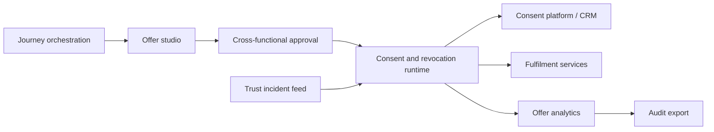

# Offertrail

**Source:** `ai-in-decentralized+ai/Accenture-Strategy-DD-GDPR-Infographic/`
**Domain:** `ai-decentralized`
**One-liner:** A customer-journey offer studio that packages tangible returns for lawful PII sharing, so retailers convert GDPR trust pressure into measurable data-for-value exchanges rather than blanket consent banners.
**Wedge:** EU-facing retail and consumer brands whose loyalty and ecommerce teams already run discounts and personalisation, but still treat GDPR as a legal checklist — starting with acquire and loyalty journeys where shoppers will trade birthday, preferences, or location for a concrete benefit.
**Positioning:** Data-for-value commercialisation ops. Accenture’s GDPR infographic argues consumers will vote with wallets *and* data: 90% will limit PII and block third-party sales, yet two-thirds will share for perceived value and three-quarters for better service or choosable sharing. Offertrail is the operating product for designing, approving, and measuring those exchanges — distinct from Trustkeep’s enterprise trust scoreboard and Forgetcase’s Article 17 case desk.

## Market research synthesis

### Thesis from source

The infographic frames GDPR (effective 25 May 2018) as a unification of EU data protection that puts citizens in control of who may use their personal data and for what purposes, affecting every company doing business with European consumers. The commercial framing is explicit: data becomes a new currency; consumers vote with wallets and data; successful companies treat GDPR as an opportunity to transform trust into value rather than a pure burden.

By 2020 each consumer is estimated to cast a digital shadow of about 2.5GB of PII. Against that volume, 90% of consumers say they will limit access to PII and prevent retailers from selling information to third parties. The same research shows willingness to share when the exchange is tangible: roughly two-thirds will share for some perceived value, and about three-quarters will share for a better level of service or the ability to choose which data goes to third parties. Trust is the loyalty driver; a material share of consumers switched providers after lost trust; in four of ten cases trust rises when breaches are handled swiftly and correctly; trusted brands see faster adoption.

Operational recommendations reject a technology-only compliance programme: focus on prioritised customer journeys and business processes; empower cross-functional teams of compliance, business, and technology; keep programme structure simple with clear end goals; and remember tools are not a silver bullet because many GDPR tools are still evolving. The product wedge follows from that: the missing artefact is not another DPIA template, but a journey-tied catalogue of value offers that make lawful sharing commercially concrete and auditable.

### Buyer & economic model

- **Primary buyer:** VP Loyalty / Head of Customer Experience co-sponsored by the DPO at a retail or consumer brand with EU customers.
- **Users:** journey owners, CRM/loyalty managers, privacy counsel (offer approval), ecommerce merchandisers, analytics partners measuring opt-in quality.
- **Budget owner / value metric:** loyalty and CRM budget; value metric is incremental lawful opt-ins and retention attributable to published value exchanges, plus reduced third-party-sale backlash.
- **Competing status quo:** generic cookie banners, one-size privacy policies, and discount campaigns disconnected from purpose-limited consent records.

### Domain constraints

- **Regulatory / trust / safety:** purpose limitation and consent specificity under GDPR; consumers can revoke access at any time if trust fails, even without a breach; third-party sharing must be choosable, not silent.
- **Data sensitivity:** offer analytics must use aggregated or pseudonymous metrics; raw PII stays in the CRM.
- **Change-management realities:** marketing will not wait for a multi-year privacy rebuild — the product must ship offer templates onto existing journeys with a cross-functional approval gate.

## Business requirements

- BR-1: Every data-collection ask must be paired with a published value offer (discount, service upgrade, choosable third-party share) before it can go live on a journey.
- BR-2: Offers must declare purpose, data categories requested, retention intent, and whether third-party sharing is optional or excluded.
- BR-3: Consumers must be able to revoke an offer’s permissions without losing unrelated account access, and revocation must stop downstream processing within a defined SLA.
- BR-4: Journey owners must see opt-in, revoke, and fulfilment rates per offer, not only enterprise averages.
- BR-5: Cross-functional approval (business, privacy, technology) must be recorded before an offer launches.
- BR-6: Third-party sharing offers must present an explicit chooser; silent on-selling of retailer PII is not a supported offer type.
- BR-7: Breach or trust-incident playbooks must be linkable to active offers so that value exchanges can be paused when trust recovery is underway.
- BR-8: Programme structure in the product must stay journey-centric (a small set of priority journeys), not a 100-node regulation taxonomy.
- BR-9: Fulfilment of the promised value (coupon issued, service unlocked) must be evidenced against the consent event for audit.
- BR-10: Exportable statements must show, for any period, which offers drove net new lawful sharing and which drove revocations.

## User stories

Canonical user stories live in sibling [USER_STORIES.md](USER_STORIES.md).

## System design

### Overview

Offertrail sits between journey orchestration (CRM, ecommerce, loyalty) and privacy governance. Marketers compose value offers bound to data categories and purposes; privacy and technology approve; the runtime issues consent artefacts and fulfilment instructions; analytics close the loop on whether consumers actually received the promised value. Revocation and trust-incident pauses propagate to downstream processors that consume the consented attributes.

### Actors & boundaries

- **Actors:** loyalty/CX lead, journey owner, privacy counsel, fulfilment systems, support agents, end consumer.
- **Trust boundary:** Offertrail stores offer definitions, approvals, consent event IDs, and fulfilment proofs — not full customer profiles. Profile PII remains in the CRM/CDP.
- **Human-in-the-loop points:** offer approval; trust-incident pause; exception when fulfilment fails after consent.

### Core capabilities

1. **Offer catalogue and templates** — journey-scoped value exchanges with purpose and data-category binding.
2. **Cross-functional approval** — business, privacy, technology decision log.
3. **Consent and revocation runtime** — issue, revoke, and pause permissions tied to offers.
4. **Fulfilment evidence** — link promised value delivery to consent events.
5. **Trust-incident controls** — pause classes of offers during breach/trust recovery.
6. **Journey analytics** — opt-in, revoke, fulfilment, and incremental retention proxies.
7. **Audit export** — period statements for regulators and internal audit.

### Conceptual data

- **Primary entities:** Journey, Offer, OfferVersion, ApprovalRecord, ConsentEvent, RevocationEvent, FulfilmentProof, TrustIncident, ProcessorHook.
- **Critical events:** offer submitted, offer approved/rejected, consent granted, value fulfilled, consent revoked, offer paused for trust incident.
- **Retention / audit needs:** approval and consent/fulfilment linkage retained for the accountability window; raw PII not retained in Offertrail.

### Integrations (conceptual)

- **Systems of record:** CRM/CDP, loyalty engine, ecommerce storefront, coupon/fulfilment services, consent management platform.
- **Upstream signals:** journey entry events, breach/trust incident flags from IR tools.
- **Downstream actions:** consent write-back to CMP, fulfilment triggers, pause webhooks to processors, analytics exports.

### High-level architecture

### Success metrics

- **Leading:** share of data asks covered by an approved value offer; median time from draft to approved offer; fulfilment success rate within 24 hours of consent.
- **Lagging:** net lawful opt-in rate on covered journeys; revoke rate after offer launch; incremental retention or conversion versus control journeys; reduction in third-party-sale complaints.

## OpenAPI skeleton

Canonical HTTP surface lives in sibling [openapi.yaml](openapi.yaml). Summary:

- **Base path:** `/v1/...`
- **Auth:** `X-API-Key` for journey/fulfilment integrations; Bearer JWT for operators.
- **Resource groups:** Journeys, Offers, Consents, Fulfilments, Incidents, Reporting.
