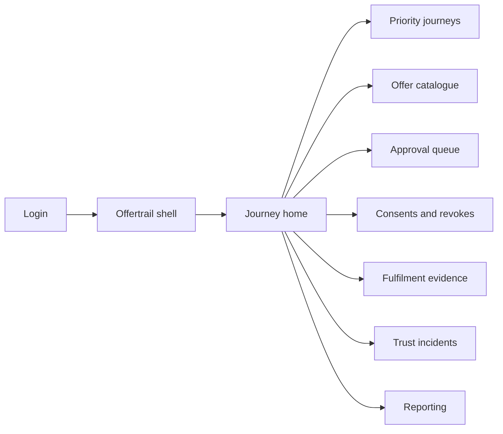
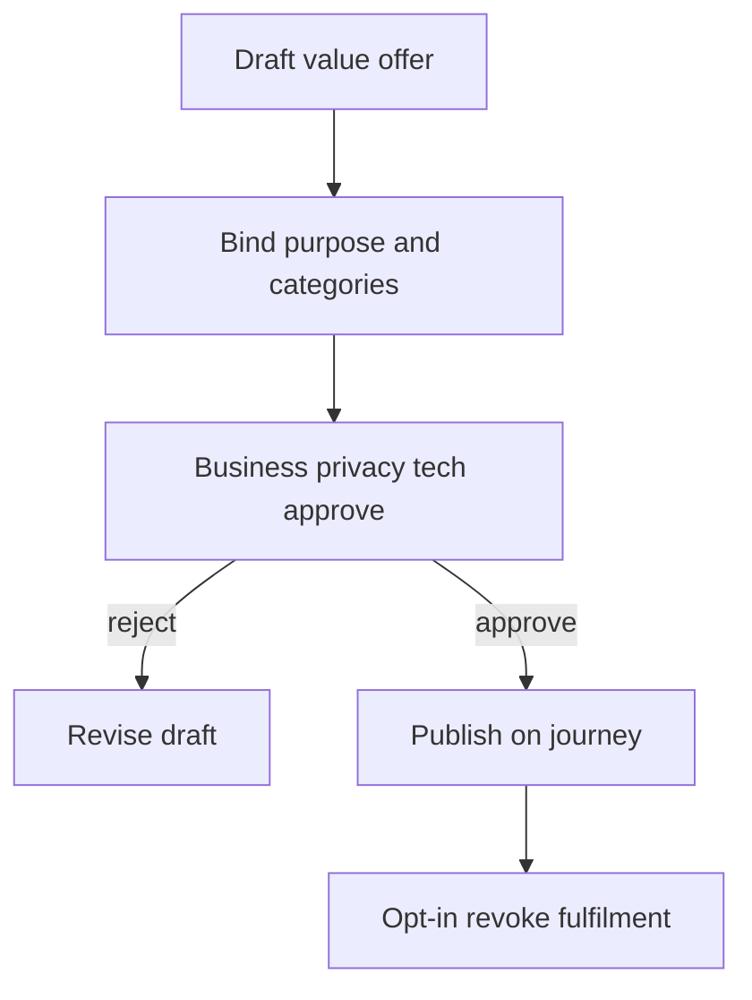

# Offertrail — Web app

**Product:** [PRODUCT.md](./PRODUCT.md)
**Primary surface:** Loyalty / CX offer studio (journey-tied data-for-value exchanges)
**Secondary surfaces:** Support agent revoke lookup; period audit statement viewer
**Design thesis:** Offertrail is a commercial exchange desk for lawful PII sharing — the UI metaphor is a journey shelf of tangible trades (birthday → reward), not a legal checklist or cookie-banner CMS. Visual language is warm charcoal with foliage-green fulfilment confirmation and amber for unfulfilled consent debt; third-party choosers feel explicit and choosable, never silent. The brand wordmark sits as a shop-tag mark on every live offer so consumers and counsel know whose promise is being measured.

## UX research synthesis

### Category peers (best-in-class)

- **Braze / Klaviyo journey builders:** Journey-centric campaigns with entry criteria and performance per path. Steal: small set of priority journeys as the spine (BR-8); reject blasting offers without purpose binding.
- **OneTrust Preference / CMP choosers:** Purpose-specific consent and third-party toggles. Steal: explicit third-party chooser UX (BR-6); reject silent reseller defaults.
- **Salesforce Loyalty / Coupon fulfilment consoles:** Evidence that promised value was issued. Steal: fulfilment proof linked to consent event (BR-9); reject vanity open-rate dashboards as the primary KPI.
- **Transcend preference centers:** Consumer revoke without full account destruction. Steal: revoke one offer’s permissions without killing unrelated access (BR-3).

### Patterns to adopt / reject

- **Adopt:** No live ask without published value offer (BR-1); purpose + categories + retention on every card; cross-functional approval gate; fulfilment-vs-consent linkage; trust-incident pause of share offers; journey-level analytics.
- **Reject:** Generic cookie walls as the product; 100-node regulation taxonomy; silent on-selling offer types; purple “AI personalisation” panels that hide the trade; Trustkeep-style enterprise scoreboard as home (different product).

### Trust, density, and workflow constraints from PRODUCT.md

Every collection ask needs a tangible return (BR-1). Offers declare purpose, categories, retention, third-party stance (BR-2). Revoke stops downstream within SLA (BR-3). Metrics per journey/offer (BR-4). Business + privacy + technology approval (BR-5). No silent third-party sale offers (BR-6). Link IR pauses (BR-7). Keep structure journey-simple (BR-8). Prove fulfilment (BR-9). Export net sharing vs revokes (BR-10).

## Information architecture

### Nav model

### Roles → default home

| Role | Default home | Why |
|------|--------------|-----|
| Loyalty / CX lead | Journey home | Compare acquire vs win-back trades |
| Privacy counsel | Approval queue | Minimisation before launch (BR-5) |
| Journey owner / merchandiser | Offer catalogue | Templates and fulfilment proof |
| Consumer support agent | Consents and revokes | Revoke on behalf of customer (BR-3) |
| Platform administrator | Trust incidents / permissions | Gate third-party offer publishers |
| Auditor | Reporting | Period statements (BR-10) |

### Cross-links to OpenAPI resources

| Nav area | OpenAPI tags / resources |
|----------|---------------------------|
| Priority journeys | Journeys |
| Offer catalogue / approvals | Offers |
| Consents and revokes | Consents |
| Fulfilment evidence | Fulfilments |
| Trust incidents | Incidents |
| Reporting | Reporting |

## Screen inventory

### Journey home

- **Purpose:** Answer “which priority journeys convert lawful sharing because the value was real?” in one composition.
- **Entry:** Post-login for loyalty/CX.
- **Layout regions:** Brand + brand switcher; three-to-five journey tiles (opt-in, revoke, fulfilment); alerts for unfulfilled consent debt and paused offers.
- **Primary actions:** Open journey; create offer; pause third-party class.
- **Empty / loading / error:** Empty = pick acquire / loyalty / win-back starters; error = retry with request id.
- **BR / story ties:** BR-4, BR-8; loyalty lead stories.

### Priority journeys

- **Purpose:** Keep programme structure simple around journeys, not regulation nodes.
- **Entry:** Nav → Journeys.
- **Layout regions:** Journey list; linked offers; orchestration integration status.
- **Primary actions:** Add journey; archive; set owners.
- **Empty / loading / error:** Cap sprawl warning if too many journeys created.
- **BR / story ties:** BR-8.

### Offer catalogue and editor

- **Purpose:** Package tangible returns bound to purpose and data categories.
- **Entry:** Journey CTA; nav → Offers.
- **Layout regions:** Catalogue table; editor panes: value promise, purpose, categories, retention, third-party chooser mode; preview of consumer-facing copy.
- **Primary actions:** Save draft; submit for approval; clone template (“birthday for reward”, “better service”, “choosable share”).
- **Empty / loading / error:** Validation blocks launch if ask lacks value or exceeds purpose needs.
- **BR / story ties:** BR-1, BR-2, BR-6.

### Cross-functional approval queue

- **Purpose:** Record business, privacy, technology decisions before go-live.
- **Entry:** Submit from editor; counsel default.
- **Layout regions:** Queue; decision panes; minimisation diff (categories vs purpose); decision log.
- **Primary actions:** Approve; reject with reason; request change.
- **Empty / loading / error:** Empty = no pending; rejected offers return to draft.
- **BR / story ties:** BR-5; privacy counsel stories.

### Consents and revokes

- **Purpose:** Runtime lookup of grant/revoke; support agents revoke without legal tickets.
- **Entry:** Support default; nav.
- **Layout regions:** Lookup by customer ref; offer permissions list; revoke action; downstream SLA status.
- **Primary actions:** Revoke offer permission; confirm stop-processing; escalate stuck processors.
- **Empty / loading / error:** No offers = clear empty; revoke failure = freeze further collection for that offer.
- **BR / story ties:** BR-3; support agent stories.
- **Mobile notes:** Agent revoke usable on tablet.

### Fulfilment evidence

- **Purpose:** Prove coupon/service unlock landed against consent event.
- **Entry:** Offer detail; merchandiser nav.
- **Layout regions:** Consent→fulfilment join table; failure queue; auto-freeze banner when fulfilment breaks after consent.
- **Primary actions:** Retry fulfilment; freeze collection; export mismatch report.
- **Empty / loading / error:** Pending fulfilment amber within 24h window.
- **BR / story ties:** BR-9; merchandiser stories.

### Trust incident controls

- **Purpose:** Pause value exchanges (especially third-party share) during trust recovery.
- **Entry:** IR flag; nav → Incidents.
- **Layout regions:** Active incidents; affected offer classes; pause/resume with audit.
- **Primary actions:** Pause third-party offers; resume after recovery; notify journey owners.
- **Empty / loading / error:** Empty = healthy; accidental resume requires confirmation.
- **BR / story ties:** BR-7.

### Reporting and audit export

- **Purpose:** Show which offers drove net new lawful sharing vs revocations.
- **Entry:** Auditor / loyalty lead.
- **Layout regions:** Period selector; offer contribution chart; export pack.
- **Primary actions:** Export statement; compare journeys.
- **Empty / loading / error:** Empty period message.
- **BR / story ties:** BR-4, BR-10.

## Key flows

1. **Launch data-for-value offer** — draft trade → bind purpose/categories → cross-functional approve → go live on journey; failure: privacy rejects over-collection (BR-1, BR-2, BR-5).

2. **Consent to fulfilment** — grant → trigger fulfilment → evidence link; failure: fulfilment miss freezes further collection (BR-9).

3. **Consumer revoke** — agent or self revoke → stop downstream within SLA → unrelated account access remains (BR-3).

4. **Trust-incident pause** — IR flag → pause third-party-share offers → resume after recovery (BR-7).

5. **Period board pack** — select window → net sharing vs revokes by offer → export (BR-10).

## Design system

### Tokens (CSS variables)

- `--color-ink: #1A1F1C` — primary text on light panels
- `--color-charcoal-950: #121614` — app chrome ground
- `--color-panel: #F3F6F2` — content panels (cool sage-tinted, not cream-terracotta)
- `--color-foliage: #2F8F5B` — fulfilled / healthy opt-in
- `--color-foliage-dim: #1C5A3A` — foliage on dark chrome
- `--color-amber: #C98A1A` — unfulfilled consent debt
- `--color-coral: #D4534B` — incident pause / revoke surge
- `--color-steel: #5C6B63` — secondary labels
- `--color-brand: #3A7D5C` — Offertrail wordmark
- `--font-display: "Fraunces", serif` — offer titles (shop-tag character)
- `--font-body: "DM Sans", sans-serif`
- `--font-mono: "DM Mono", monospace` — consent event ids
- `--space-1`…`--space-8`: 4px scale
- `--radius-sm: 6px`; `--radius-md: 10px`
- `--motion-fulfil: 200ms ease-out` — fulfilment check
- `--motion-pause: 240ms ease-in-out` — incident veil
- `--motion-approve: 180ms ease-out` — gate pass
- Atmosphere: soft paper grain on panels; journey shelf imagery direction (retail aisle of offers), not abstract purple gradients.

### Typography & brand

- Fraunces for offer names and journey titles; DM Sans for ops density; mono for consent ids.
- Brand as shop-tag on live offer chrome and login hero (“Trade data for a clear return”).
- First viewport marketing/login: brand, one headline, one CTA — no stat strips of GDPR fine amounts.

### Do / don’t

- **Do:** Pair every ask with value; show fulfilment proof; explicit third-party chooser; journey-simple IA.
- **Don’t:** Cookie-banner CMS as home; silent resale; purple AI glow; 100-node legal tree; cream-serif-terracotta cliché.

### Accessibility & domain trust cues

- AA+ contrast on foliage/amber/coral; pause states announced to live regions.
- Focus order: journey → offer → approval → consent → fulfilment → report.

## Component patterns

- **ValueOfferCard** — promise + purpose + categories + third-party mode.
- **ApprovalTripleGate** — business / privacy / technology decisions.
- **ConsentFulfilmentJoin** — evidence row linking events.
- **RevokeWithoutAccountKill** — scoped permission revoke.
- **TrustPauseVeil** — incident overlay on offer classes.
- **JourneyKpiStrip** — opt-in / revoke / fulfilment per journey.
- **MinimisationDiff** — categories requested vs purpose need.
- **PeriodShareStatement** — audit export of net lawful sharing.

## Out of scope for v1 web

- Enterprise trust scoreboard (Trustkeep); Article 17 erasure mesh (Erasuremesh/Forgetcase); full CMP replacement for all web pixels; native mobile apps; agency white-label multi-brand portals beyond single-tenant brand orgs.
